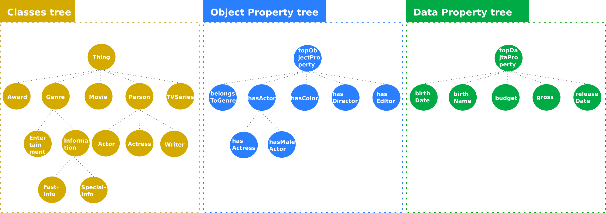
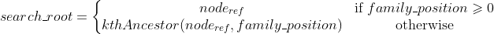
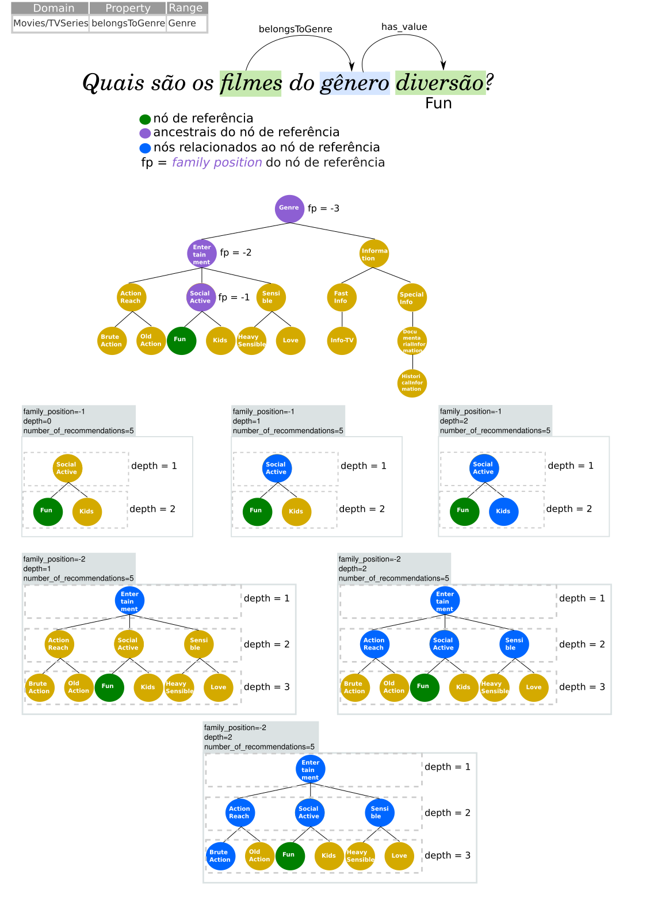
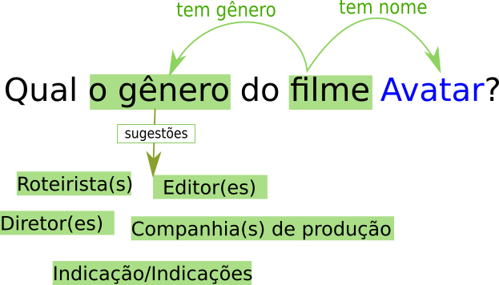

# ontoexplorer


## Árvores da ontologia

Este repositório contém o código fonte das recomendações de classes e propriedades da ontologia utilizada pelo [OntoIQA-Bot](https://github.com/JessicaCardoso/OntoIQA-Bot). Para a construção das árvores de ontologias são necessários os seguintes requisitos: 

**Requisitos:**

- Arquivo contendo a  ontologia (ex.: [movieontology.ttl](movieontology.ttl))
- Arquivo contendo os labels das propriedades (ex.: [properties_labels.ini](properties_labels.ini))

> Obs: É necessária a instalação das bibliotecas do Pipefile.

No notebook [onto_tree_build.ipynb](onto_tree_build.ipynb) é realizada a construção das árvores através da classe _OntologyTrees_, o arquivo da ontologia deve ser um formato aceito pela biblioteca [rdflib](https://rdflib.readthedocs.io/en/stable/).

```python
from ontotrees import OntologyTrees

onto_trees = OntologyTrees()

# Carregar o grafo da ontologia em três árvores de hierarquia (classes, propriedades de objeto e propriedades de dado)
onto_trees.load_ontology("movieontology.ttl", format="ttl")

# Nomes das árvores carregadas
onto_trees.trees_names
# >> ['classes', 'object_properties', 'data_properties']
```

Na Figura a seguir ilustramos parte das árvores carregadas pela classe _OntologyTrees_.

 </img>

## Recomendação de nós

O processo de recomendação realizada na classe `Recommendation` é ajustado no arquivo de configurações [recommendation.ini](recommendation.ini). Onde:

| **Params**                | **Default**       | **Description**                                                                                          |
| ------------------------- | ----------------- | -------------------------------------------------------------------------------------------------------- |
| family_position           | -2                | Nível em relação ao *nó de referência* pode assumir valores menore ou iguais a zero.                     |
| filter_by                 | both              | Se a indicação do nó deve ser baseada no _range_, _domain_ ou ambos.                                     |
| depth                     | 3                 | Profundidade da busca na árvore a partir da *family_position*, pode assumir apenas valores positivos.    |
| order                     | random            | A forma como as sugestões serão apresentadas, se nenhum parâmetro for passado retorna na ordem da busca. |
| number_of_recommendations | 5                 | Quantidade máxima de recomendações, deve ser um número maior do que zero.                                |
| ontology_filename         | movieontology.ttl | Nome do arquivo da ontologia que se encontra no mesmo nível de *recommendation.py*.                      |
| ontology_format           | ttl               | formato da ontologia, formato definido de acordo com os formatos da rdflib.                              |

> nó de referência, é o nó que desejamos substituir por outro

### Nós relacionados:

Para realizar a consulta de nós relacionados, é necessária a definição de alguns parâmetros, dentre eles a *family\_position* que indica qual dentre os ancestrais do nó de referência será utilizado como raiz da busca. A equação e o pseudocódigo descrevem esse processo: 



Onde *node_ref* é o nó de referência e *search_root* é novo nó calculado, a função *kthAncestor* é definida no bloco de código a seguir, onde ancestors indica os ancestrais do nó dado.

```
PROGRAM kthAncestor(node_ref, family_position):
    var node_ancestors = ancestors(node_ref);
    var count = 0;
    WHILE (count < node_ancestor.length)
        var node = node_ancestors[count];
        IF (-count == family_position)
            THEN Return node;
        ENDIF;
        count = count + 1;
    ENDWHILE;
END.
```

Se na árvore de classes, o nó de referência for *Actor*, e o *family_position* for definido como -1, o *root_ref* apontaria para o nó *Person*.

Outro parâmetro importante é a profundidade da consulta na árvore que é definida pela variável _depth_ que pode assumir apenas valores positivos. Suponha que o *node_ref* seja o nó *Person*, se a profundidade definida for 1, então todos os filhos de *Person* podem ser sugeridos.

Também podemos filtrar os nós a serem sugeridos com base em seu domínio e  alcance, na tabela a seguir temos alguns exemplos de nós da árvore de propriedade com seus respectivos *domains* e *ranges*, para o próximo exemplo vamos considerar o *family_position* e a *depth=2*.

| **Object Property** | **Domain**            | **Range**      |
| ------------------- | --------------------- | -------------- |
| belongsToGenre      | Movie/TVSeries        | Genre          |
| hasActress          | Movie/TVSeries        | Actress        |
| hasActor            | Movie/TVSeries        | Actor          |
| isAwardedWith       | Movie/TVSeries/Person | Award          |
| wrote               | Writer                | Movie/TVSeries |

Dada a propriedade *wrote* se quisermos delimitar pelo *Range*, teremos zero sugestões, pois não existe outra propriedade com o *Range* de *wrote* nesta tabela. Entretanto se filtramos a propriedade pelo *Domain* podemos sugerir a propriedade *isAwardedWith*, pois *Writer* é descendente de *Person* como podemos ver na imagem _Classes Tree_. 

Caso a propriedade de referência seja *belongsToGenre* e filtremos pelo *Domain* teremos como sugestão *hasActress*, *hasActor* e *isAwardedWith* pois compartilham domínios em comum com *belongsToGenre*.

Na figura a seguir mostramos o processo de sugestão de nós baseados no *range* da propriedade *belongsToGenre* e algumas variações de *depth* e *family_position*.

<p align="center">

</p>

### Exemplo:

<p align="center">

</p>

```python
from recommendations import Recommendation

# Qual o gênero do filme Avatar?
rec = Recommendation()

question_triples =  [
    ("http://www.movieontology.org/2009/10/01/movieontology.owl#Movie", "has_value", "Avatar"),
     ("http://www.movieontology.org/2009/10/01/movieontology.owl#Movie", "http://www.movieontology.org/2009/10/01/movieontology.owl#belongsToGenre", "http://www.movieontology.org/2009/10/01/movieontology.owl#Genre")
]

rec.get_recommendations(question_triples)
#['[Gênero(s)] -> [Diretor(es)]', '[Gênero(s)] -> [Companhia(s) de produção]', '[Gênero(s)] -> [Roteirista(s)]', '[Gênero(s)] -> [Editor(es)]', '[Gênero(s)] -> [Indicação/Indicações]']
```
